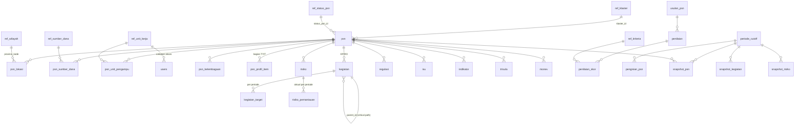

# Rancangan Aplikasi SIRENDA PSN v2

**Dashboard Monitoring & Evaluasi Proyek Strategis Nasional — Kementerian PPN/Bappenas**

Status dokumen: draf untuk telaah · 8 Oktober 2026

---

## 1. Latar belakang dan tujuan

SIRENDA PSN (sirenda-psn.id) saat ini berjalan di atas basis data `sirendapsn_bappenas` (MariaDB 10.11, 85 tabel + 27 view). Telaah terhadap dump 7 Oktober 2026 menemukan beberapa hambatan struktural untuk membangun dashboard monev:

| Masalah pada basis data lama | Dampak | Penyelesaian di v2 |
|---|---|---|
| Satu tabel `master` (96.958 baris) untuk semua kode referensi, tanpa foreign key | Integritas tidak terjamin; kode tidak dikenal lolos (mis. sumber dana `F`, unit `#N/A`) | Tabel `ref_*` per domain + FK |
| Target/realisasi disimpan melebar (`target_2026` … `target_2030`, `target_persen_1` … `_12`) | Tidak dapat diagregasi lintas periode, tidak dapat di-snapshot | Tabel memanjang per periode (`kegiatan_target`, `indikator_target`, dst.) |
| Kolom campur format (`psn.pendanaan` berisi JSON dan kode tunggal) | Agregasi P6 tidak andal | `psn_sumber_dana` ternormalisasi |
| Risiko hanya label (Rendah…Sangat Tinggi); aktual hanya di `monev_risiko` | Heatmap 5×5 dan skor 1–25 tidak mungkin | Kolom kemungkinan × dampak untuk awal, harapan, aktual |
| Riwayat berupa salinan baris di 30+ tabel `*_log`, plus salinan `_1`, `_2`, `_oke` | Sulit ditelusuri, duplikasi | Satu `audit_log` (nilai lama/baru JSON) |
| Tidak ada cut-off, snapshot, atau alur verifikasi | Tidak ada pembanding "vs cut-off sebelumnya", tren bulanan, maupun indikator kualitas data | `periode_cutoff`, `pengisian_psn`, `snapshot_*` |
| `created_by` berupa teks username/email | Audit dan RBAC tidak dapat dikaitkan ke pengguna | FK ke `users` |
| Encoding rusak (U+FFFD menggantikan NBSP) | Teks tampil dengan karakter aneh | Dibersihkan saat ETL |

Tujuan v2: **basis data terpadu yang ternormalisasi** sebagai fondasi dashboard monev, dengan **ETL berulang** dari sistem lama selama masa transisi.

## 2. Arsitektur

```
┌──────────────────────┐   legacy:import   ┌──────────────────────────────────────────┐
│ sirendapsn_bappenas  │ ────────────────▶ │ sirenda_psn_v2 (MySQL 8)                 │
│ (lama, read-only)    │   (ETL berulang)  │  ref_* · psn_* · kegiatan · risiko · ... │
└──────────────────────┘                   │  periode_cutoff · snapshot_* · audit_log │
                                           └──────────────┬───────────────────────────┘
                                                          │ SQL view + snapshot
                                           ┌──────────────▼───────────────────────────┐
                                           │ Service (StatusResolver, ScoringService, │
                                           │ SnapshotService, DashboardService, ...)  │
                                           └──────────────┬───────────────────────────┘
                                                          │ JSON {data, meta:{cutoff, filter}}
                                           ┌──────────────▼───────────────────────────┐
                                           │ /api/v1/*  ──▶ Blade + Alpine + ECharts  │
                                           │                 + Leaflet                │
                                           └──────────────────────────────────────────┘
```

| Lapisan | Pilihan | Catatan |
|---|---|---|
| Backend | Laravel 11, PHP 8.2+ | Repo ini |
| Basis data | MySQL 8 (diuji juga di MariaDB 10.11) | InnoDB, utf8mb4 |
| Otorisasi | spatie/laravel-permission 6 + Policy + global scope | Lihat §7 |
| UI | Blade + Alpine.js + Tailwind 3 (Livewire untuk form kompleks) | Font Plus Jakarta Sans, token warna navy `#0E2747`, aksen `#1F6FD1` |
| Grafik / peta | Apache ECharts / Leaflet + GeoJSON provinsi | `ref_wilayah.hc_key` disimpan untuk kompatibilitas peta lama |
| Ekspor | maatwebsite/excel (Excel), barryvdh/laravel-dompdf (PDF) | Fase 4 |
| Cache | Cache Laravel per kunci `cutoff+filter`; dibatalkan saat snapshot terbit | TTL di `config/psn_dashboard.php` |

## 3. Peta modul dan rute

| Rilis | Rute | Halaman | Sumber data utama |
|---|---|---|---|
| v1 | `/dashboard` | Ringkasan Eksekutif | `snapshot_psn`, `snapshot_kegiatan` |
| v1 | `/proyek` | Portofolio PSN | `v_psn_ringkas` (+ snapshot untuk status) |
| v1 | `/proyek/{id}` | Detail Proyek, 8 tab | Tabel inti |
| v1 | `/perencanaan` | Penilaian Usulan PSN | `usulan_psn`, `penilaian`, `penilaian_skor`, `ref_kriteria` |
| v2 | `/risiko` | Risiko, Isu & Regulasi | `risiko`, `risiko_pemantauan`, `snapshot_risiko`, `isu`, `regulasi` |
| v1 | `/peta` | Peta Sebaran | `psn_lokasi` + `ref_wilayah` |
| v1 | `/kualitas-data` | Kualitas Data | `pengisian_psn`, `snapshot_kelengkapan` |
| v2 | `/laporan` | Laporan | Snapshot per cut-off |
| — | `/pengaturan/*` | Master data, pengguna & peran, kamus indikator, cut-off | `ref_*`, `users`, `periode_cutoff` |

Tab Detail Proyek dipetakan ke tabel sebagai berikut:

| Tab | Tabel |
|---|---|
| Profil | `psn`, `psn_kelembagaan`, `psn_lokasi`, `psn_sumber_dana`, `psn_unit_pengampu`, `psn_profil_item`, `psn_sdgs` |
| Perencanaan | `indikator(_target)`, `penerima_manfaat(_target)`, `trisula(_target)`, `psn_target_tahunan`, hasil penilaian bila berasal dari usulan |
| KP/RO | `kegiatan` (hierarki `parent_id`, `is_critical_path`) |
| Progres & Anggaran | `kegiatan_target`, `snapshot_kegiatan` (kurva S) |
| Risiko & Isu | `risiko`, `risiko_pemantauan`, `risiko_perlakuan`, `isu` |
| Regulasi | `regulasi`, `regulasi_target_tahun` |
| Stakeholder | `psn_stakeholder` (level 1–4) |
| Dokumen & Riwayat | `psn_dokumen`, `audit_log` (`psn_id`) |

## 4. Model data

Skema lengkap: `database/migrations/` (sumber kebenaran), DDL hasil: `docs/skema/sirenda_psn_v2.sql`, kamus kolom: `docs/kamus-data.md`.

### 4.1 Kelompok tabel

| Kelompok | Tabel |
|---|---|
| Referensi (12) | `ref_wilayah`, `ref_klaster`, `ref_sub_klaster`, `ref_klaster_pkpn`, `ref_program`, `ref_status_psn`, `ref_sumber_dana`, `ref_unit_kerja`, `ref_instansi`, `ref_penanggung_jawab`, `ref_kode`, `ref_kriteria` |
| Profil PSN (13) | `psn`, `psn_kelembagaan`, `psn_unit_pengampu`, `psn_lokasi`, `psn_sumber_dana`, `psn_sdgs`, `psn_profil_item`, `psn_target_tahunan`, `psn_dukungan`, `psn_fasilitas`, `psn_evaluasi_status`, `psn_dokumen`, `psn_stakeholder` |
| Kinerja & KP/RO (8) | `indikator`, `indikator_target`, `penerima_manfaat`, `penerima_manfaat_target`, `trisula`, `trisula_target`, `kegiatan`, `kegiatan_target` |
| Risiko, regulasi, isu (7) | `risiko`, `risiko_tahun_perlakuan`, `risiko_perlakuan`, `risiko_pemantauan`, `regulasi`, `regulasi_target_tahun`, `isu` |
| Monev & penilaian (12) | `monev` + 7 tabel anak, `usulan_psn`, `usulan_lokasi`, `penilaian`, `penilaian_skor` |
| Tata kelola & snapshot (9) | `periode_cutoff`, `pengisian_psn`, `pengisian_psn_riwayat`, `audit_log`, `login_log`, `snapshot_psn`, `snapshot_kegiatan`, `snapshot_risiko`, `snapshot_kelengkapan` |
| Pengguna & peran | `users` (+ `unit_kerja_id`), tabel spatie |
| View | `v_psn_ringkas`, `v_kegiatan_progres` |

### 4.2 Relasi inti



### 4.3 Konvensi

- PK `BIGINT UNSIGNED` auto-increment, kecuali `ref_wilayah.kode` (kode Kemendagri).
- Baris hasil impor menyimpan asal: `legacy_id` (id lama) atau `legacy_ref` (`tabel:id` bila sumbernya lebih dari satu tabel).
- Data inti memakai kolom jejak `created_by/updated_by/deleted_by` (FK `users`) + soft delete (macro `Blueprint::jejak()`).
- Nilai uang dalam **Rupiah penuh** (`DECIMAL(24,2)`). Persentase capaian **tidak disimpan**; dihitung dari target dan realisasi.
- Periode: `periode` = `TAHUNAN|TRIWULAN|BULANAN`, `periode_ke` = 0 / 1–4 / 1–12.
- Kode enum disimpan sebagai `VARCHAR` dengan komentar kolom (tanpa `ENUM` MySQL) agar mudah diubah lewat migrasi aditif.

### 4.4 Pemetaan tabel lama → baru

| Lama | Baru | Transformasi |
|---|---|---|
| `master` (24 tipe) | `ref_*`, `ref_kode` | Dipecah per domain; `peta.hc-key` → `ref_wilayah.hc_key` |
| `pertanyaan` | `ref_kriteria` | Dikodekan KU1–3, KP1–6, KK1–5; kondisional pengusul/infrastruktur ditandai |
| `psn` | `psn` + `psn_kelembagaan` + `psn_sumber_dana` | Kolom pengusul/PJ (kode PJWB) dan pelaksana/pengelola/kontraktor/supervisi (teks) → baris per peran; `psn.status` (SKIF) → `ketersediaan_info_id` |
| `psn_penanggung_jawab`, `unit_pengampu`, `lokasi_psn`, `psn_pendanaan`, `psn_sdgs` | `psn_kelembagaan`, `psn_unit_pengampu`, `psn_lokasi`, `psn_sumber_dana`, `psn_sdgs` | FK + validasi kode |
| `psn_item` | `psn_profil_item` | `jenis` → `bagian_id` (TYIT) |
| `psn_kebutuhan` | `isu` (jenis A), `psn_evaluasi_status` (jenis B) | Isu ditambah PIC, tenggat, status |
| `psn_kegiatan`, `psn_kegiatan_cp` | `kegiatan` | CP menjadi anak (`parent_id`), `is_critical_path = true` |
| `psn_kegiatan` kolom per tahun, `psn_kegiatan_detil(_cp)` kolom per bulan | `kegiatan_target` | Melebar → memanjang |
| `psn_indikator`, `psn_penerima`, `psn_trisula`, `psn_trisula_triwulan` | `indikator(_target)`, `penerima_manfaat(_target)`, `trisula(_target)` | Melebar → memanjang |
| `psn_risiko`, `psn_pj_perlakuan` | `risiko`, `risiko_tahun_perlakuan`, `risiko_perlakuan`, `risiko_pemantauan` | `cek_YYYY` → baris tahun; residual → pemantauan |
| `psn_regulasi` | `regulasi`, `regulasi_target_tahun` | Tahap pipeline default `IDENTIFIKASI` |
| `monev_*` | `monev` + 7 anak | 1:1 |
| `psn_2027` | `usulan_psn`, `usulan_lokasi` | Usulan RKP 2027 |
| `*_log` (30+), `user_logs` | `audit_log`, `login_log` | Salinan baris → nilai lama/baru |
| `users` | `users` + peran spatie | Hash kata sandi **tidak** dibawa; semua pengguna wajib reset |
| `psn_1`, `psn_2`, `psn_oke`, `*_1`, `*_2`, `v_*` rusak | — | Tidak diimpor (salinan kerja/cadangan) |

## 5. Alur data

1. **Input dan pemutakhiran.** Operator K/L dan Direktorat mengisi profil, KP/RO, risiko, dan sebagainya. Setiap perubahan dicatat di `audit_log` oleh observer.
2. **Pengajuan dan verifikasi per cut-off.** Status di `pengisian_psn` berjalan `DRAFT → DIAJUKAN → DIVERIFIKASI` (atau `DIKEMBALIKAN`). Setiap transisi dicatat di `pengisian_psn_riwayat` dan `audit_log`.
3. **Penerbitan cut-off.** `php artisan psn:snapshot 2026-09` (bisa dijadwalkan) membekukan nilai ke `snapshot_*`, menandai `periode_cutoff.status = TERBIT`, lalu membatalkan cache dashboard.
4. **Dashboard** membaca snapshot untuk angka per cut-off dan pembanding, serta view untuk data terkini (portofolio, detail).
5. **ETL masa transisi.** Selama aplikasi lama masih dipakai untuk input, `php artisan legacy:import --fresh` dijalankan sebelum setiap cut-off. ETL dihentikan setelah input dipindahkan ke v2.

## 6. Aturan bisnis (semua ambang di `config/psn_dashboard.php`)

| Aturan | Rumus | Kunci config |
|---|---|---|
| Status progres | deviasi = realisasi − rencana (pp). On Track > −5; Berisiko −5 s.d. −20; Terlambat < −20; Tanpa data jika pembaruan > 35 hari dari cut-off | `status_progres.*` |
| Level risiko | skor = kemungkinan × dampak. Rendah 1–4, Sedang 5–9, Tinggi 10–16, Sangat Tinggi 17–25. Data lama berbasis label dipetakan ke skor representatif. | `risiko.*` |
| K3 | tertimbang investasi atau rata-rata sederhana | `k3_metode` |
| K4 | Terlambat ATAU risiko residual ≥ Tinggi | `risiko.kritis_min_level` |
| Tahapan | STAT 5→Perencanaan, 4→Transaksi, 3→Konstruksi, 1/2→Operasi; 6 = tidak aktif | `tahap` |
| P6 skema dana | DANA → APBN/APBD/KPBU/Lainnya | `skema_dana` |
| Penilaian usulan | Gate KU1–KU3 (satu "Tidak" → DITOLAK, tanpa pengecualian); skor komponen = Σskor ÷ (3 × n) × 100; nilai akhir = 0,35·P + 0,35·K + 0,15·L + 0,15·T | `penilaian.*` |
| Kelengkapan | field wajib terisi ÷ field wajib × 100, per bagian | `field_wajib.*` |
| Investasi anomali | di luar Rp1 juta – Rp2.000 T ditandai dan dikecualikan dari K2 | `investasi.*` |

Service: `StatusResolver` dan `SnapshotService` (termasuk perhitungan kelengkapan) sudah tersedia. `ScoringService` (Fase 4) dan `DashboardService` (Fase 2) menyusul. Setiap batas ambang diuji di `tests/Unit/StatusResolverTest.php`. Cache dashboard memakai `App\Support\DashboardCache` (versi dinaikkan saat snapshot terbit).

## 7. Hak akses

| Peran | Ringkasan | Portofolio | Detail | Perencanaan | Risiko | Kualitas | Pengaturan |
|---|---|---|---|---|---|---|---|
| Super Admin | K | K | K | K | K | K | K |
| Pimpinan | L | L | L | L | L | L | – |
| Tim Koordinasi/PMO | L | L | L | K | L | L | – |
| Direktorat Sektor | L | L | V¹ | V¹ | I¹ | L | – |
| Operator K/L | L¹ | L¹ | I¹ | I¹ | I¹ | L¹ | – |

L = lihat, I = input, V = verifikasi, K = kelola penuh. ¹ = terbatas pada sektor/proyek sendiri.

- Izin `modul.aksi` bersifat kumulatif (kelola ⊃ verifikasi ⊃ input ⊃ lihat); lihat `PeranSeeder`.
- Implementasi: `App\Models\Scopes\CakupanAksesScope` (trait `DalamCakupanPsn`) untuk lihat¹ dan `App\Policies\PsnPolicy` untuk input¹/verifikasi¹. Daftar peran terbatas ada di `psn_dashboard.rbac`. Audit otomatis lewat trait `Auditable` (`App\Observers\AuditObserver`), dan kolom jejak terisi otomatis lewat `HasJejak`.
- Tanda ¹ ditegakkan oleh **global scope** pada model PSN dan turunannya: `psn_id IN (SELECT psn_id FROM psn_unit_pengampu WHERE unit_kerja_id = users.unit_kerja_id)`. Untuk Operator K/L, kecocokan juga dicari lewat `psn_kelembagaan`.
- Pemetaan pengguna lama: `administrator` → Super Admin, `monev` → Tim Koordinasi/PMO, `user` (akses = kode direktorat) → Direktorat Sektor, `kementerian` (akses = kode unit K/L) → Operator K/L. `users.akses` lama menjadi `unit_kerja_id`. Peran **Pimpinan** tidak ada di sistem lama sehingga ditetapkan manual.

## 8. API (semua menerima filter global yang sama dan mengembalikan `{ data, meta: { cutoff, filter } }`)

| Endpoint | Sumber | Cache |
|---|---|---|
| `GET /api/v1/dashboard/kpi` | `snapshot_psn` (cut-off aktif dan sebelumnya) | per cut-off + filter |
| `GET /api/v1/dashboard/distribusi?dim=klaster\|direktorat\|provinsi\|dana` | `snapshot_psn` | per cut-off + filter |
| `GET /api/v1/dashboard/progres` | `snapshot_psn`, `snapshot_kegiatan` | per cut-off + filter |
| `GET /api/v1/dashboard/tren` | `snapshot_psn` Jan–Des | per cut-off + filter |
| `GET /api/v1/dashboard/ro-kritis?limit=10` | `snapshot_kegiatan` | per cut-off + filter |
| `GET /api/v1/proyek` | `v_psn_ringkas` + `snapshot_psn` | 5 menit |
| `GET /api/v1/proyek/{id}` | tabel inti | tanpa cache |
| `GET /api/v1/usulan/{id}/skor` | `penilaian`, `penilaian_skor` | tanpa cache |
| `GET /api/v1/kualitas-data` | `pengisian_psn`, `snapshot_kelengkapan` | harian |

Parameter filter: `periode=2026-09`, `prov=31,32`, `klaster=3,7`, `dit=12`, `status=terlambat`, `kat=psn|pkpn`, `dana=kpbu`.

### 8.1 Implementasi Fase 2

- Endpoint ada di `routes/web.php` (prefix `/api/v1`, sesi web satu origin, middleware `auth` + `akun.aktif` + `can:ringkasan.lihat`). Tambahan: `GET /api/v1/dashboard/{tahapan,status-data,trisula,timeline-dp,aktivitas}`, `GET /api/v1/filter-opsi`, dan `GET /api/v1/kamus-indikator`.
- `App\Support\Dashboard\FilterGlobal` mem-parsing dan memvalidasi filter (422 bila tidak valid). Periode yang belum terbit menghasilkan 404.
- `App\Services\DashboardService` membaca `snapshot_psn` lewat model ber-scope cakupan, lalu memfilter dan mengagregasi di PHP. Kolom JSON multi-nilai (provinsi, unit, sumber dana) diperlakukan seragam di MySQL dan MariaDB. Kunci cache memuat cut-off, filter, dan **cakupan pengguna**, sehingga angka tidak bocor antar-unit.
- Kinerja pada data riil (380 PSN): seluruh 13 panel dihitung dalam 271 ms tanpa cache dan 10 ms dengan cache.
- Frontend: Blade + Alpine (`resources/js/filter.js` untuk store filter global yang tersinkron ke URL, `resources/js/dashboard/*`). ECharts dimuat terpisah (code-split, 175 kB gzip) hanya di halaman bergrafik. Font Plus Jakarta Sans di-host sendiri (tanpa CDN).
- Filter silang: klik batang klaster, provinsi, atau sumber dana, atau chip status, menambah filter global. Klik kartu KPI membuka `/proyek?{filter}` (K4 menambah `kritis=1`). Tombol Reset menghapus semua filter.
- Peta choropleth P7 sementara digantikan grafik batang 12 provinsi teratas (menunggu GeoJSON, Q-12).
- Login memakai nama pengguna atau email, dibatasi 5 percobaan per menit per akun+IP, dan dicatat di `login_log`. Sesi habis setelah 30 menit tanpa aktivitas (`SESSION_LIFETIME=30`). Akun nonaktif langsung dikeluarkan. Akun hasil impor wajib mengganti kata sandi (minimal 12 karakter, huruf besar, huruf kecil, dan angka).

### 8.2 Implementasi Fase 3

- **Portofolio** (`/proyek`, `GET /api/v1/proyek`) dibaca dari `snapshot_psn` cut-off yang sama dengan dashboard. Akibatnya, jumlah baris untuk setiap kombinasi filter **identik dengan K1**. Hal ini diuji untuk 10 kombinasi filter. Filter JSON multi-nilai di SQL memakai `JSON_CONTAINS` (`FilterGlobal::terapkanSql`), padanan `FilterGlobal::cocok`.
  - Opsi tabel di luar filter global: `q` (nama/kode), `urut` (`nama|kode|klaster|investasi|progres|deviasi|status|kelengkapan|risiko`), `arah`, `kritis=1` (drill-down K4), `tahap`, `nonaktif=1`, `per_halaman` (10–100), `page`. `format=csv` mengunduh semua baris terfilter.
  - Kinerja: 18 ms per halaman tabel.
- **Detail Proyek** (`/proyek/{id}`, `GET /api/v1/proyek/{id}`) dirender di server dan tidak di-cache (37 ms).
  - Tab yang tersedia: Profil, KP/RO (hierarki + critical path), Progres & Anggaran (kurva S dari snapshot terbit dengan penanda merah bila Terlambat, ringkasan deviasi, tabel RO + tautan bukti, isu terbuka dengan penanda lewat tenggat, jejak audit), serta Dokumen & Riwayat (riwayat 100 perubahan dengan nilai lama/baru).
  - Tab Perencanaan, Risiko & Isu, Regulasi, dan Stakeholder masih placeholder.
  - PSN di luar cakupan Operator K/L menghasilkan 404. Breadcrumb dan tombol Kembali mempertahankan filter serta opsi tabel portofolio.
- **Kualitas Data** (`/kualitas-data`, `GET /api/v1/kualitas-data`):
  - KPI dengan pembanding cut-off sebelumnya;
  - kelengkapan per sektor (klik untuk filter direktorat);
  - heatmap sektor × 18 bagian profil (Gambaran Umum, 12 item `TYIT`, 5 data relasi);
  - 50 PSN dengan kelengkapan terendah beserta field kosongnya;
  - log aktivitas.

  Hasil di-cache harian dan dibatalkan saat snapshot terbit. Waktu hitung 285 ms tanpa cache. Snapshot kelengkapan kini disimpan per bagian (`gambaran_umum`, `item:{TYIT}`, `relasi:{tabel}`).
- **"Sektor" sementara = direktorat pengampu** (`ref_unit_kerja.jenis = DIREKTORAT`) sampai Q-06 diputuskan.
- **ETL riwayat**: perubahan (UPDATE) dari tabel `*_log` kini hanya menyimpan kolom yang benar-benar berubah. Simpan-ulang tanpa perubahan tidak dicatat. Stempel waktu tidak lagi dikarang: `audit_log.created_at` boleh null untuk riwayat lama tanpa waktu.

### 8.3 Implementasi Fase 4

- **`App\Services\ScoringService`** (10 uji unit, termasuk gate override):
  - Gate KU1–KU3 bersifat mutlak: satu "Tidak" langsung menjadi DITOLAK, bahkan bila sub-kriteria lain belum diisi atau nilai akhirnya 100.
  - Skor komponen = Σ skor ÷ (3 × n) × 100, dengan n = sub-kriteria yang **berlaku**. KP4–KP6 bergantung pada jenis pengusul; KK3–KK4 hanya berlaku untuk usulan infrastruktur. Skor komponen hanya dihitung bila semua sub-kriteria yang berlaku sudah dinilai. Tidak ada redistribusi bobot.
  - Nilai akhir = 0,35·P + 0,35·K + 0,15·L + 0,15·T.
  - Rekomendasi: `DIREKOMENDASIKAN | DIPERTIMBANGKAN | TIDAK_DIREKOMENDASIKAN | DITOLAK | BELUM_LENGKAP | AMBANG_BELUM_DITETAPKAN`. Ambang masih `null` (Q-11).
  - Hasil disimpan sebagai cache di tabel `penilaian`; sumber kebenaran tetap `penilaian_skor`.
- **Halaman `/perencanaan`**:
  - daftar usulan dengan filter K/L, klaster, tahun, status, dan rekomendasi, diurutkan berdasarkan nilai akhir;
  - formulir usulan baru;
  - layar penilaian sesuai wireframe: gate (banner merah DITOLAK), 4 kartu komponen, gauge nilai akhir dan rekomendasi, formulir sub-kriteria (skor dan temuan), peta usulan vs PSN eksisting, serta perbandingan antar-usulan.
  - Alur status: DRAFT → FINAL (verifikasi), dan FINAL → DRAFT (kelola). Setiap perubahan tercatat di audit (`VERIFY`, `RETURN`, dan perubahan skor).
  - `GET /api/v1/usulan/{id}/skor`.
- **Hak akses Perencanaan** (`UsulanPsnPolicy`):
  - Pimpinan: lihat.
  - PMO: kelola.
  - Direktorat Sektor: verifikasi¹.
  - Operator K/L: input¹ (usulan baru otomatis diberi unit pengguna).
  - Tanda ¹ = `usulan_psn.unit_kerja_id` (kolom baru, aditif) sama dengan unit pengguna. Pembatasan lihat bagi Operator diterapkan di level query.
- **Butir sementara Lokasi (KL1) dan Trisula (KT1)**: satu butir per komponen sampai sub-kriteria resmi ditetapkan (Q-10). Butir ini dapat diganti lewat `ref_kriteria`.
- **Ekspor**:
  - PDF Ringkasan Eksekutif (`/laporan/ringkasan.pdf?{filter}`, dompdf; angka sama dengan dashboard);
  - Excel portofolio (`/api/v1/proyek?format=xlsx`, Laravel Excel);
  - CSV portofolio;
  - PNG/CSV per panel.
- **Peta** (`/peta`, `GET /api/v1/peta`): Leaflet dibundel dan dimuat terpisah. Sementara memakai lingkaran proporsional di titik tengah 38 provinsi (`ref_wilayah.lat/lng`). Klik provinsi menambah filter global.
  - Bila berkas `public/geo/provinsi.geojson` (properti `kode` = kode provinsi) tersedia, peta **otomatis menjadi choropleth** (Q-12).
  - Tile peta diatur lewat `PETA_TILE_URL`. Kosongkan untuk jaringan intranet tanpa akses internet, atau isi dengan server tile internal.
- **Halaman `/risiko`**: placeholder rilis v2.

## 9. Hasil impor awal (dump 7 Oktober 2026)

Hasil `php artisan legacy:import` dan uji akurasinya (`LEGACY_TEST=1 php artisan test`): jumlah PSN, lokasi, item profil, regulasi, KP/RO, agregat per provinsi, agregat per klaster, dan total nilai investasi **identik** dengan basis data lama.

| Entitas | Baris v2 | Catatan |
|---|---|---|
| PSN | 380 (333 aktif + 47 tanpa status) | 7 berstatus "Keluar dari PSN" |
| Lokasi | 533 (331 PSN) | |
| Sumber dana | 602 | gabungan `psn_pendanaan` + kolom `psn.pendanaan` |
| Unit pengampu | 1.232 | |
| KP/RO | 169 (46 PSN), target 134 baris | Realisasi bulanan hanya 7 baris |
| Risiko | 90 (36 PSN) | 76 risiko lama tanpa `psn_id` tidak dapat diimpor |
| Item profil | 1.848 | |
| Isu | 356 | |
| Audit log | 1.859 | dari `*_log` |
| Pengguna | 222 (51 aktif) | wajib reset kata sandi |

**Temuan kualitas data yang perlu ditindaklanjuti pemilik data:**

1. **Nilai investasi salah satuan (7 PSN).** Contoh: Masela Rp287.941.000 T, Bendungan Pamukkulu Rp2.316 T, Pelabuhan Wanam Rp805. Ketujuh PSN ini ditandai `investasi_anomali`. Setelah dikecualikan, total investasi = Rp8.956,1 T (271 PSN). Angka ini pun masih perlu diverifikasi.
2. **76 risiko tanpa `psn_id`** (dibuat 28–29 Sept) dan **134 baris perlakuan risiko** yang merujuk risiko yang sudah dihapus.
3. **Kode tidak dikenal:** sumber dana `F` (3 PSN), unit `431`, `39`, `#N/A`, dan instansi `24`, `29`.
4. **Data uji di produksi:** antara lain risiko "test", perlakuan "adad"/"bbbbccc", critical path "aaaa".
5. **Progres fisik terstruktur hampir kosong:** realisasi bulanan hanya untuk 7 periode, dan progres proyek masih berupa teks bebas (`status_teks`, mis. "99,7 %"). K3, P2, dan P5 belum bisa menghasilkan angka bermakna sampai pelaporan berjalan di v2.
6. **Master UNIT mencampur direktorat Bappenas, unit K/L, pemda, BUMN, dan nama proyek.** `ref_unit_kerja.jenis` hanya klasifikasi heuristik dan perlu dikurasi.

## 10. Keputusan terbuka

| No | Pertanyaan | Asumsi sementara |
|---|---|---|
| Q-01 | Arti `psn.sumber` (1/2) | Disimpan apa adanya di `sumber_input` |
| Q-02 | Satuan baku investasi dan anggaran KP/RO | Rupiah penuh |
| Q-03 | Pemetaan BUMN dan Badan Usaha/Swasta ke KPBU | D → KPBU, C → Lainnya |
| Q-04 | Sumber % progres fisik proyek (K3) | Agregat tertimbang `kegiatan_target.realisasi_persen` |
| Q-05 | Definisi "RO tercapai" (P4) | realisasi ≥ target pada periode terakhir |
| Q-06 | "Sektor" dalam taksonomi klaster–sektor–direktorat | Belum dimodelkan; kandidat: sub klaster (`ref_sub_klaster`) |
| Q-07 | Kategori PKPN | `klaster_pkpn_id` terisi → PKPN (118 PSN) |
| Q-08 | Arti `psn_stakeholder.jenis` A/B dan pemetaan ke level 1–4 | jenis A = pemetaan stakeholder, B = kerangka kelembagaan; `level` diisi ulang manual |
| Q-09 | `monev_header.jenis` 1/2 | 1 = Pengendalian, 2 = Perencanaan |
| Q-10 | Sub-kriteria Lokasi dan Trisula pada penilaian usulan | Butir sementara KL1 dan KT1 (skor 0–3); ganti dengan daftar resmi di `ref_kriteria` |
| Q-11 | Ambang rekomendasi penilaian (Direkomendasikan/Dipertimbangkan) | `null` (TODO di config) |
| Q-12 | Sumber GeoJSON provinsi | Lingkaran proporsional di titik tengah provinsi; letakkan GeoJSON di `public/geo/provinsi.geojson` untuk choropleth |
| Q-13 | Penanganan data uji dan 76 risiko yatim | Tidak diimpor; daftar ada di laporan ETL |
| Q-14 | Status pengguna lama `0` dan `H` | Hanya `A` dianggap aktif |

## 11. Rencana fase

| Fase | Lingkup | Status |
|---|---|---|
| 0 | Eksplorasi dan pemetaan | Selesai |
| 1a | Basis data baru, referensi, peran, ETL, uji akurasi impor, dokumen ini | **Selesai (repo ini)** |
| 1b | `StatusResolver` + test, `psn:snapshot` + `SnapshotService`, observer audit, global scope RBAC + `PsnPolicy`, model Eloquent inti, `docs/kamus-indikator.md` lengkap | **Selesai** |
| 2 | Ringkasan Eksekutif: endpoint dashboard, layout grid, filter global + URL, filter silang, tooltip ⓘ, bar status data, login & ganti kata sandi | **Selesai** |
| 3 | Portofolio, Detail Proyek (Profil, KP/RO, Progres, Dokumen & Riwayat), Kualitas Data | **Selesai** |
| 4 | Perencanaan + `ScoringService`, Policy, ekspor PNG/CSV/PDF/Excel, peta provinsi | **Selesai** |
| 5 | Feature test endpoint, uji akurasi K1–K4/P1–P7 terhadap query acuan, uji hak akses, profil kinerja | **Selesai**; lihat `docs/kriteria-selesai-v1.md` |
